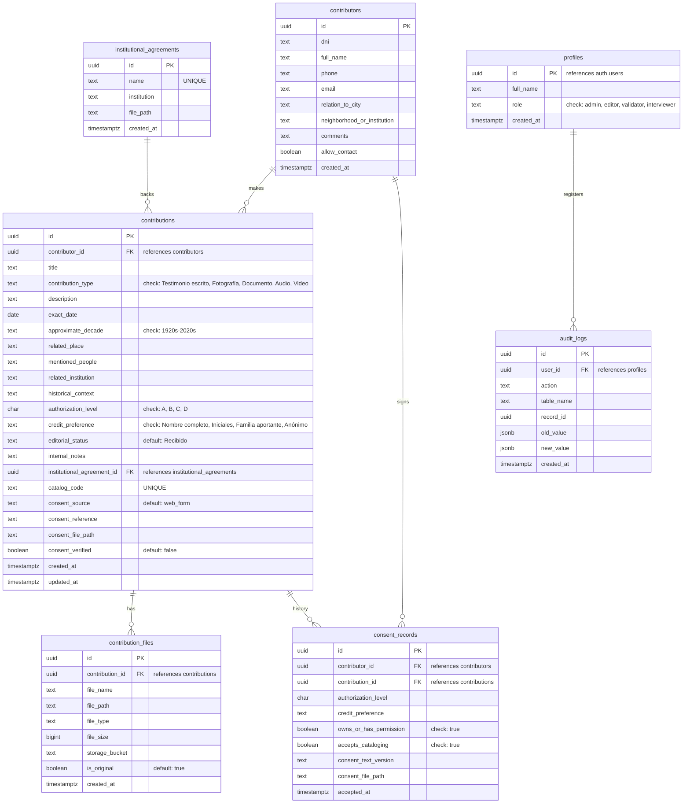
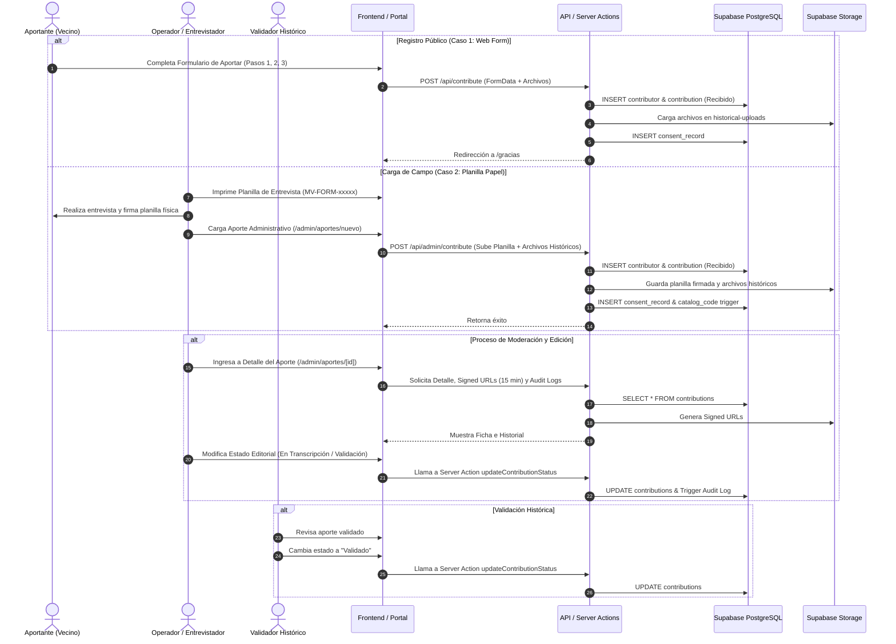
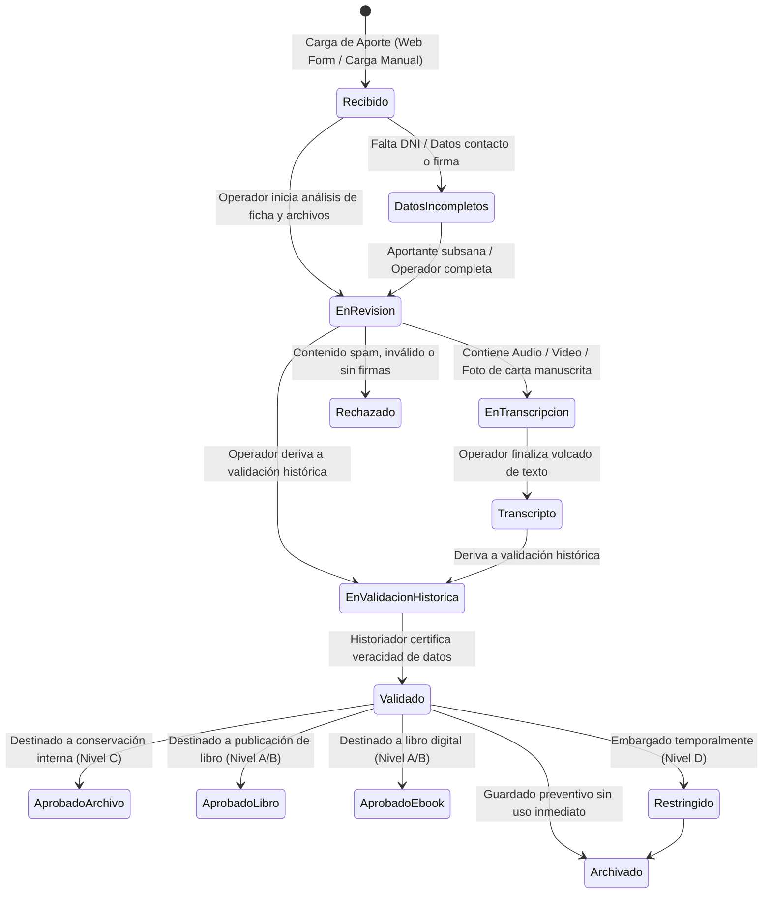
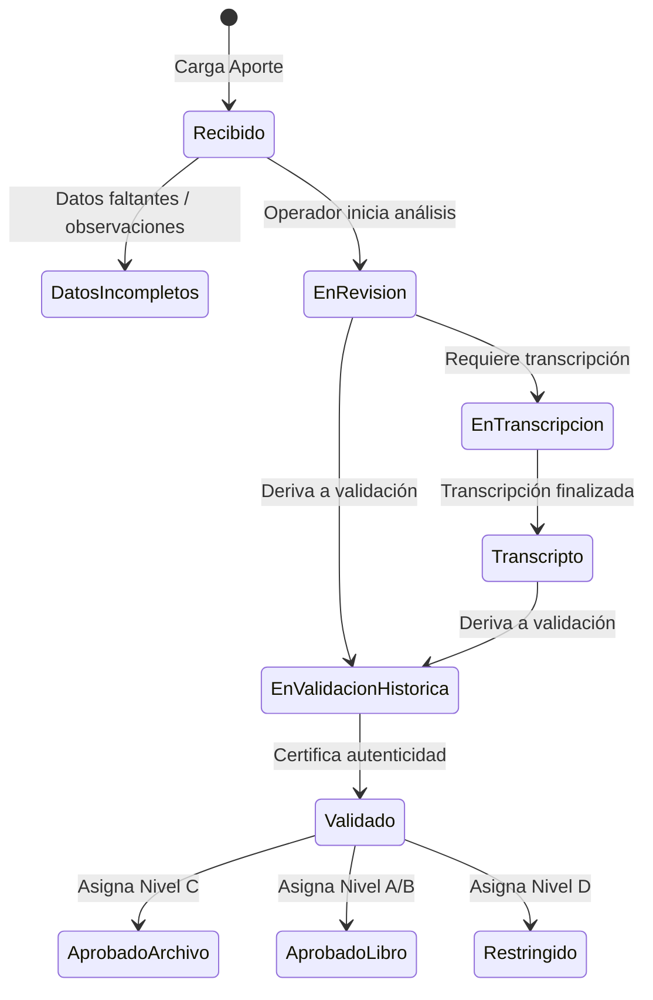
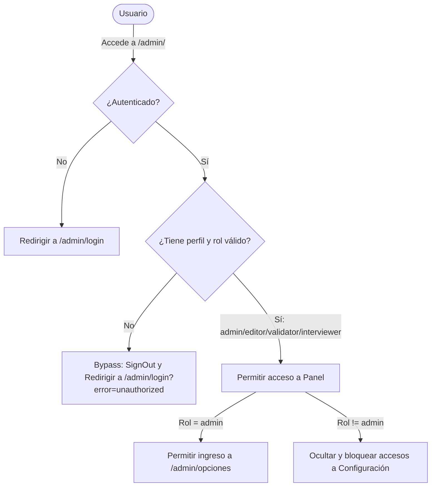
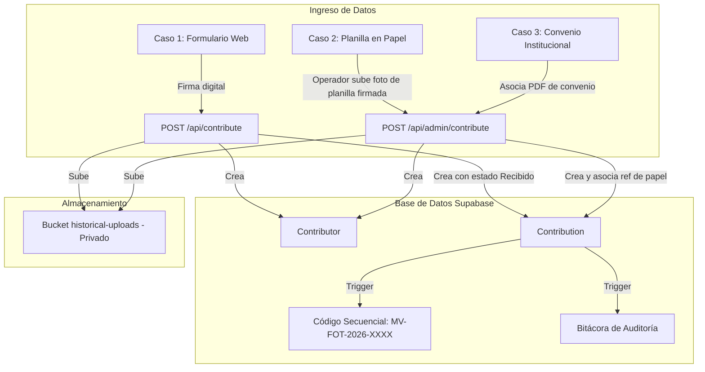

# Documentación Técnica y Funcional Completa
## Proyecto: Memoria Viva Pico Truncado (Etapa 1 - MVP)

---

## 1. VISIÓN GENERAL

### Objetivo del Proyecto
El proyecto **Memoria Viva Pico Truncado** tiene como objetivo fundamental la recopilación, conservación, catalogación y puesta en valor del patrimonio histórico e intangible de la localidad de Pico Truncado, Provincia de Santa Cruz, Argentina. Nace como una iniciativa para salvaguardar relatos de vida, vivencias, fotografías familiares, correspondencia, audios y documentos antiguos que corren riesgo de perderse con el transcurrir de las generaciones.

### Problema que Resuelve
1. **Pérdida del patrimonio intangible**: La falta de registro de las historias de pioneros y familias fundadoras de la localidad.
2. **Dispersión documental**: Inexistencia de un repositorio centralizado seguro para digitalizar fotos y archivos antiguos en posesión de los vecinos.
3. **Falta de consentimiento legal estructurado**: Carencia de un marco de autorizaciones formales (cesión de derechos) que defina qué se puede publicar, qué se reserva para consulta educativa y qué se mantiene únicamente para preservación.
4. **Acceso limitado a la historia local**: Dificultad para que escuelas, historiadores y el público general accedan a fuentes primarias de información verídica y local.

### Público Objetivo
* **Aportantes (Vecinos e Instituciones)**: Familias de pioneros, trabajadores ferroviarios, petroleros, e instituciones truncateñas que desean salvaguardar sus archivos históricos.
* **Equipo Editorial y de Gestión**: Coordinadores (Edith Gómez, Adrián Montet), transcriptores, redactores y validadores históricos responsables del tratamiento del material.
* **Investigadores e Historiadores**: Profesionales e interesados en la historia de la Patagonia austral.
* **Comunidad Educativa**: Docentes y alumnos de escuelas primarias y secundarias de la provincia de Santa Cruz.

### Arquitectura General
El sistema está construido bajo un enfoque moderno y desacoplado, combinando un framework de frontend de última generación con servicios integrados en la nube:
* **Frontend**: Next.js 16 (App Router) con componentes React 19 y estilos nativos optimizados (Vanilla CSS).
* **Backend**: Next.js Server Actions y API Routes (Endpoints serverless).
* **BaaS (Backend-as-a-Service)**: Supabase, encargado de la Base de datos (PostgreSQL), la Autenticación (Supabase Auth) y el Almacenamiento seguro (Supabase Storage).
* **Infraestructura**: Desplegado en Vercel con integración continua.

### Tecnologías Utilizadas
* **Framework**: [Next.js 16.2.9](https://nextjs.org) (App Router).
* **Biblioteca UI**: [React 19.2.4](https://react.dev).
* **Lenguaje**: TypeScript.
* **Cliente BD**: `@supabase/supabase-js` v2.108.2 y `@supabase/ssr` v0.12.0.
* **Iconografía**: `lucide-react` v1.21.0.
* **Estilos**: Vanilla CSS optimizado con variables semánticas (custom properties) y diseño responsivo sin frameworks pesados.
* **Entorno de Ejecución**: Node.js v20+.

### Estado Actual del Desarrollo
La plataforma se encuentra en su **Etapa 1 - MVP (Mínimo Producto Viable)**. En esta fase, el foco exclusivo está puesto en la **recolección segura, catalogación y gestión administrativa/legal** del material histórico. 

### Funcionalidades Implementadas
* **Formulario Multi-paso de Aporte Público**: Carga de relatos y archivos por parte de la ciudadanía con firma de consentimiento digital implícito.
* **Formulario de Registro de Aportantes**: Pantalla de inscripción voluntaria para vecinos ("Quiero formar parte") integrada al sistema de aportes.
* **Panel de Administración Protegido**: Dashboard para visualizar métricas, revisar aportes recibidos, descargar archivos históricos mediante URLs firmadas temporales y consultar logs de auditoría.
* **Gestor de Convenios Institucionales**: Carga de convenios en PDF y asociación de aportes en lote para instituciones locales.
* **Planillas de Campo Secuenciales**: Generación y exportación para impresión A4 de planillas de entrevista con códigos secuenciales y códigos QR únicos.
* **Controlador de Combos/Opciones Dinámicas**: Interfaz administrativa para gestionar categorías de selección (`select_options`).

### Funcionalidades Pendientes (Próximas Etapas)
* **Portal Público de Consulta (exposiciones digitales o museo virtual en una etapa posterior)**: Visualización y búsqueda abierta del catálogo de aportes autorizados (Nivel A).
* **Portal de Transparencia Activa**: Módulo público para auditar estadísticas y convenios.
* **Automatización de Transcripción**: Módulo de IA para transcripción de testimonios de audio/video.
* **Generador de Manuscritos**: Exportación en formato EPUB/PDF para compilación del libro de relatos históricos.

---

## 2. ARQUITECTURA

El flujo arquitectónico del sistema se detalla en el siguiente diagrama:

```mermaid
graph TD
    User([Visitante / Aportante]) -->|HTTP / HTTPS| Vercel[Vercel Hosting]
    Editor([Equipo Editorial / Admin]) -->|Autenticación| Vercel
    
    subgraph Next.js App Router (Vercel)
        PublicPages[Public Routes /aportar, /proyecto]
        AdminPages[Protected Routes /admin, /admin/aportes]
        ServerActions[Server Actions contributions.ts, auth.ts]
        APIRoutes[API Endpoints /api/contribute, /api/select-options]
    end
    
    Vercel --> PublicPages
    Vercel --> AdminPages
    AdminPages --> ServerActions
    PublicPages --> APIRoutes
    
    subgraph Supabase Cloud
        Auth[Supabase Auth / Session Cookie]
        Database[(PostgreSQL Database)]
        Storage[Supabase Storage - Bucket Privado]
    end
    
    ServerActions -->|Bypass RLS via Service Role Key| Database
    ServerActions -->|Bypass RLS via Service Role Key| Storage
    APIRoutes -->|Bypass RLS via Service Role Key| Database
    APIRoutes -->|Bypass RLS via Service Role Key| Storage
    
    AdminPages -.->|Read Session & Profiles| Auth
    Database -.->|Trigger Update Profile| Auth
    Database -.->|Trigger Audit Logs| Database
```

* **Frontend**: Next.js sirve los archivos HTML pre-renderizados desde el servidor (SSR) y gestiona la interactividad en el cliente (CSR). Los estilos globales residen en [globals.css](file:///c:/Users/pc/Documents/antigravity/memoriaviva/src/app/globals.css) con un diseño visual que aprovecha una paleta cálida basada en tonos pastel, tipografía *Montserrat* para títulos y *Open Sans* para textos.
* **Backend**: El backend corre en la nube como funciones Serverless en Vercel. Las Server Actions en [contributions.ts](file:///c:/Users/pc/Documents/antigravity/memoriaviva/src/app/actions/contributions.ts) controlan los cambios de estado editorial, y las API Routes en [contribute/route.ts](file:///c:/Users/pc/Documents/antigravity/memoriaviva/src/app/api/contribute/route.ts) y [admin/contribute/route.ts](file:///c:/Users/pc/Documents/antigravity/memoriaviva/src/app/api/admin/contribute/route.ts) procesan la recepción de archivos de hasta 50MB.
* **Supabase**:
  * **Autenticación**: Proporciona el registro e inicio de sesión. La sesión de usuario es capturada en el servidor mediante middleware y cookies HTTP utilizando la biblioteca `@supabase/ssr`.
  * **Storage**: Los archivos de aportes (fotos, documentos, audios, videos) se guardan en el bucket privado `historical-uploads`. El acceso público directo está denegado; los administradores autorizados visualizan el material a través de *Signed URLs* (enlaces firmados) con un vencimiento de 15 minutos (900 segundos).
  * **Base de datos (PostgreSQL)**: Contiene tablas relacionales que estructuran los aportes, aportantes, convenios y auditoría de cambios. Row Level Security (RLS) restringe los accesos directos desde clientes no autorizados.
* **GitHub**: Aloja el código fuente y sincroniza los despliegues de Vercel.
* **Vercel**: Acomoda el frontend y el backend de Next.js, proveyendo compresión automática, almacenamiento en caché perimetral y optimización de imágenes.
* **Servicios Externos**:
  * `api.qrserver.com`: Genera dinámicamente códigos QR incorporados en las planillas de entrevista impresas, facilitando a los operadores escanear el papel físico con un teléfono móvil y abrir automáticamente el aporte respectivo en el panel de administración.
* **Variables de Entorno**:
  * `NEXT_PUBLIC_SUPABASE_URL`: Endpoint de la API REST de Supabase.
  * `NEXT_PUBLIC_SUPABASE_ANON_KEY`: Clave pública para interactuar de forma segura desde el navegador (respetando RLS).
  * `SUPABASE_SERVICE_ROLE_KEY`: Clave de servicio privada (Service Role) con superpoderes para eludir políticas RLS en el servidor durante la inserción y carga de archivos privados.
  * `INITIAL_ADMIN_EMAIL`, `INITIAL_ADMIN_PASSWORD`, `INITIAL_ADMIN_NAME`: Credenciales por defecto para inicializar la cuenta de administrador.
* **Dependencias importantes**:
  * `next`, `react`, `react-dom`, `@supabase/supabase-js`, `@supabase/ssr`, `lucide-react`, `tsx`, `dotenv`, `typescript`.

---

## 3. MODELO DE DATOS

El esquema relacional de la base de datos se describe en el siguiente diagrama:



A continuación se detalla la definición técnica de cada tabla según el archivo [schema.sql](file:///c:/Users/pc/Documents/antigravity/memoriaviva/supabase/schema.sql):

### 3.1 Tabla: `profiles`
* **Objetivo**: Extender los datos de autenticación de Supabase (`auth.users`) asociando un nombre completo y un rol administrativo específico al personal editorial.
* **Campos**:
  * `id` (`UUID`, PK): Clave primaria que referencia a `auth.users(id)`.
  * `full_name` (`TEXT`): Nombre completo del operador.
  * `role` (`TEXT`): Rol del usuario en el sistema. Restricción `CHECK (role IN ('admin', 'editor', 'validator', 'interviewer'))`.
  * `created_at` (`TIMESTAMPTZ`): Fecha de creación del perfil.
* **Relaciones**:
  * `id` referenciado por `auth.users(id) ON DELETE CASCADE`.
* **Políticas RLS**:
  * Lectura: Permitida para el propio usuario autenticado o para usuarios con rol `admin`.
  * Modificación (Insert/Update/Delete): Permitida únicamente para el rol `admin`.
* **Triggers**:
  * `on_auth_user_created` (AFTER INSERT ON `auth.users`): Ejecuta `public.handle_new_user()` para sincronizar automáticamente el perfil de la cuenta de autenticación con la tabla `profiles`.

### 3.2 Tabla: `contributors`
* **Objetivo**: Almacenar la información de contacto y afiliación de los vecinos e instituciones aportantes.
* **Campos**:
  * `id` (`UUID`, PK, Default `gen_random_uuid()`): Identificador único.
  * `dni` (`TEXT`): Documento Nacional de Identidad (o "Convenio" para organizaciones).
  * `full_name` (`TEXT`): Nombre completo del aportante o institución.
  * `phone` (`TEXT`): Teléfono de contacto.
  * `email` (`TEXT`): Correo electrónico.
  * `relation_to_city` (`TEXT`): Vínculo biográfico (ej. "Vecino actual", "Pionero", etc.).
  * `neighborhood_or_institution` (`TEXT`): Barrio de pertenencia o institución representada.
  * `comments` (`TEXT`): Observaciones provistas en el registro.
  * `allow_contact` (`BOOLEAN`, default `FALSE`): Autorización expresa para ser contactado.
  * `created_at` (`TIMESTAMPTZ`): Fecha de registro.
* **Políticas RLS**:
  * Inserción: Permitida de forma pública (rol `anon` y `authenticated`).
  * Lectura: Permitida a cualquier usuario autenticado con rol `admin`, `editor`, `validator` o `interviewer`.
  * Actualización: Permitida a roles `admin` y `editor`.
  * Eliminación: Permitida únicamente al rol `admin`.

### 3.3 Tabla: `institutional_agreements`
* **Objetivo**: Registrar los convenios firmados con entidades educativas o gubernamentales que amparan la recolección en lote.
* **Campos**:
  * `id` (`UUID`, PK): Identificador único.
  * `name` (`TEXT`, UNIQUE): Nombre descriptivo del convenio.
  * `institution` (`TEXT`): Nombre de la entidad asociada.
  * `file_path` (`TEXT`): Ruta de almacenamiento del archivo PDF del convenio en el Storage.
  * `created_at` (`TIMESTAMPTZ`): Fecha de registro.
* **Políticas RLS**:
  * Lectura: Permitida para todo el equipo autenticado (`admin`, `editor`, `validator`, `interviewer`).
  * Inserción: Permitida para todo el equipo autenticado.

### 3.4 Tabla: `contributions`
* **Objetivo**: La tabla central que contiene los metadatos históricos del recuerdo u objeto aportado.
* **Campos principales**:
  * `id` (`UUID`, PK): Identificador único del aporte.
  * `contributor_id` (`UUID`): Relación con el aportante.
  * `title` (`TEXT`): Título del recuerdo.
  * `contribution_type` (`TEXT`): Formato del material (Restricción CHECK: 'Testimonio escrito', 'Fotografía', 'Documento', 'Audio', 'Video').
  * `description` (`TEXT`): Transcripción, relato detallado o descripción física.
  * `exact_date` (`DATE`): Fecha exacta del suceso (opcional).
  * `approximate_decade` (`TEXT`): Década sugerida (Restricción CHECK: '1920s' hasta '2020s').
  * `related_place` (`TEXT`): Ubicación geográfica asociada (barrio, calle o comercio histórico).
  * `mentioned_people` (`TEXT`): Personas nombradas en el recuerdo.
  * `related_institution` (`TEXT`): Entidades vinculadas.
  * `historical_context` (`TEXT`): Acontecimientos históricos que rodean el aporte.
  * `authorization_level` (`CHAR(1)`): Nivel de cesión (CHECK: 'A', 'B', 'C', 'D').
  * `credit_preference` (`TEXT`): Preferencia de créditos (CHECK: 'Nombre completo', 'Iniciales', 'Familia aportante', 'Anónimo').
  * `editorial_status` (`TEXT`, default 'Recibido'): Estado editorial del flujo.
  * `catalog_code` (`TEXT`, UNIQUE): Signatura del archivo (ej. `MV-FOT-2026-0004`).
  * `consent_source` (`TEXT`, default 'web_form'): Origen legal (CHECK: 'web_form', 'signed_paper', 'institutional_agreement').
  * `consent_reference` (`TEXT`): Código secuencial del formulario físico o convenio de respaldo.
  * `consent_file_path` (`TEXT`): Ruta del archivo PDF/imagen de la planilla de consentimiento firmada.
  * `consent_verified` (`BOOLEAN`, default `FALSE`): Bandera que indica si el soporte legal ha sido validado manualmente por el equipo administrativo.
* **Políticas RLS**:
  * Inserción: Permitida de forma pública (anon/authenticated).
  * Lectura y Actualización: Restringida a roles del equipo (`admin`, `editor`, `validator`, `interviewer`).
  * Eliminación: Permitida únicamente al rol `admin`.
* **Triggers**:
  * `audit_contributions_trigger` (AFTER INSERT OR UPDATE OR DELETE): Escribe de forma automatizada en `audit_logs`.
  * `update_contributions_updated_at` (BEFORE UPDATE): Actualiza la columna `updated_at` al momento de modificar el registro.
  * `contributions_catalog_code_trigger` (BEFORE INSERT): Ejecuta `public.generate_catalog_code()` para calcular la signatura institucional.

### 3.5 Tabla: `contribution_files`
* **Objetivo**: Metadatos de los archivos cargados (imágenes de alta calidad, grabaciones de audio WAV/MP3, PDF, etc.).
* **Campos**:
  * `id` (`UUID`, PK): Identificador del archivo.
  * `contribution_id` (`UUID`, FK): Referencia al aporte amparado.
  * `file_name` (`TEXT`): Nombre original del archivo.
  * `file_path` (`TEXT`): Ubicación lógica en el storage privado.
  * `file_type` (`TEXT`): MIME type del archivo.
  * `file_size` (`BIGINT`): Tamaño en bytes.
  * `storage_bucket` (`TEXT`): Bucket de destino (`historical-uploads`).
  * `is_original` (`BOOLEAN`, default `TRUE`): Flag de originalidad.
* **Políticas RLS**:
  * Inserción: Permitida de forma pública.
  * Lectura: Permitida al equipo de administración.
  * Actualización/Eliminación: Permitida a los roles `admin` y `editor`.

### 3.6 Tabla: `consent_records`
* **Objetivo**: Registro de auditoría legal. Almacena cada versión y revalidación de las firmas de consentimiento.
* **Campos**:
  * `id` (`UUID`, PK): Identificador único.
  * `contributor_id` (`UUID`, FK), `contribution_id` (`UUID`, FK)
  * `authorization_level` (`CHAR(1)`), `credit_preference` (`TEXT`)
  * `owns_or_has_permission` (`BOOLEAN`), `accepts_cataloging` (`BOOLEAN`)
  * `consent_text_version` (`TEXT`): Versión del texto legal aceptado.
  * `consent_file_path` (`TEXT`): Ruta del documento firmado adjunto.
  * `accepted_at` (`TIMESTAMPTZ`): Fecha y hora del consentimiento.
* **Políticas RLS**:
  * Inserción: Permitida públicamente.
  * Lectura: Permitida al equipo.
  * Control total (ALL): Permitido para el rol `admin`.

### 3.7 Tabla: `audit_logs`
* **Objetivo**: Mantener una bitácora inalterable de los cambios efectuados sobre las fichas históricas de aportes.
* **Campos**:
  * `id` (`UUID`, PK)
  * `user_id` (`UUID`, FK): Referencia a `profiles(id)`.
  * `action` (`TEXT`): Acción realizada (`INSERT`, `UPDATE`, `DELETE`).
  * `table_name` (`TEXT`): Tabla afectada (`contributions`).
  * `record_id` (`UUID`): Clave del registro modificado.
  * `old_value` (`JSONB`): Estado del registro previo a la modificación.
  * `new_value` (`JSONB`): Estado final del registro.
  * `created_at` (`TIMESTAMPTZ`): Fecha del suceso.
* **Políticas RLS**:
  * Lectura: Permitida exclusivamente a usuarios autenticados con rol `admin` y `editor`.

### 3.8 Configuración del Storage: Bucket `historical-uploads`
* **Tipo**: Privado (`public = FALSE`).
* **Límite de tamaño**: 50 MB por archivo.
* **Tipos de archivo permitidos**:
  * Imágenes: `image/jpeg`, `image/jpg`, `image/png`, `image/webp`
  * Documentos: `application/pdf`, `application/msword`, `application/vnd.openxmlformats-officedocument.wordprocessingml.document`
  * Audios: `audio/mpeg`, `audio/mp3`, `audio/wav`, `audio/x-m4a`, `audio/m4a`, `audio/mp4`, `audio/aac`
  * Videos: `video/mp4`, `video/quicktime`, `video/mov`
* **Políticas de Acceso**:
  * Inserción: Permitida públicamente (rol `anon` y `authenticated`).
  * Lectura (SELECT): Permitida al equipo (`admin`, `editor`, `validator`, `interviewer`).
  * Eliminación (DELETE): Permitida a los roles `admin` y `editor`.

---

## 4. FLUJO DEL USUARIO

El ciclo de interacción de los diferentes actores de la plataforma sigue este camino estructurado:



### 4.1 Visitante
1. Accede a la página de Inicio y visualiza los objetivos de preservación e identidad barrial.
2. Navega a la sección **Sobre el Proyecto** para informarse sobre los impulsores y patrocinadores locales.
3. Lee el documento de **Políticas de Privacidad** para comprender sus derechos sobre los archivos y testimonios.

### 4.2 Aportante (Ciudadano)
1. Ingresa a la pantalla `/aportar`.
2. **Paso 1 (Datos Personales)**: Rellena DNI, nombre, e-mail, teléfono, relación con la ciudad (ej. "Vecino actual") y barrio o institución.
3. **Paso 2 (Información del Aporte)**: Proporciona un título, tipo de material (Fotografía, Audio, etc.), descripción del recuerdo, fecha o década estimada y lugar geográfico de pertenencia. Sube los archivos históricos correspondientes.
4. **Paso 3 (Consentimiento Legal)**: Elige el Nivel de Autorización (A, B, C o D), selecciona la preferencia de créditos para futuras publicaciones y acepta bajo juramento la declaración de propiedad intelectual y derecho a catalogar.
5. Envía el formulario y es dirigido a la pantalla `/gracias`. El sistema guarda el aportante, crea el aporte bajo el estado **"Recibido"**, almacena los archivos en el bucket privado, y registra el consentimiento inicial.

### 4.3 Colaborador / Voluntario (Registro Simplificado)
1. Accede a `/quiero-formar-parte`.
2. Completa un formulario enfocado en datos personales, fecha y lugar de nacimiento, y proporciona un breve relato o narrativa inicial.
3. El frontend encapsula la información de postulación y realiza un POST al endpoint de contribuciones, creando un perfil de aportante y guardando su narración preventiva con un estado legal preventivo (**Nivel C - Archivo Interno**) y créditos anónimos, permitiendo al equipo editorial contactarlo en una etapa posterior.

### 4.4 Operador / Entrevistador (Equipo de Campo)
1. Se loguea mediante el portal `/admin/login`.
2. Imprime un lote de planillas en blanco de entrevista desde `/admin/print?blank=true`. Estas planillas contienen numeraciones correlativas `MV-FORM-xxxxx` pre-calculadas y códigos QR de enlace directo.
3. En el territorio de Pico Truncado, entrevista al vecino pionero, registra sus relatos a mano y le hace firmar físicamente la cesión de derechos sobre la planilla impresa.
4. Regresa al centro administrativo y accede a `/admin/aportes/nuevo`.
5. Rellena los datos en el Wizard, seleccionando la opción **"Planilla Firmada en papel (Carga Manual)"**.
6. Escribe el número correlativo del papel en la casilla de referencia, digitaliza (foto o PDF) la planilla firmada y la sube al sistema junto con los archivos históricos digitalizados (fotografías escaneadas o audios de la entrevista).
7. Envía el formulario. El backend archiva el aporte y la planilla vinculada.

### 4.5 Editor / Redactor (Tratamiento del Contenido)
1. Examina las novedades en el Dashboard.
2. Ingresa al listado `/admin/aportes`, buscando aportes en estado **"Recibido"**.
3. Abre el detalle de un aporte (`/admin/aportes/[id]`). El sistema solicita y genera *Signed URLs* temporales en el momento para permitirle previsualizar o descargar los archivos originales.
4. Si el aporte requiere correcciones o transcripción (por ejemplo, digitalizar un archivo de audio), el editor actualiza el estado a **"En transcripción"** y posteriormente a **"Transcripto"**.
5. Si detecta datos incompletos en el contacto o DNI, modifica el estado a **"Datos incompletos"** y agrega observaciones en las notas internas de la ficha.

### 4.6 Validador Histórico (Verificación de Veracidad)
1. Consulta los aportes listos para contrastación.
2. Modifica el estado editorial a **"En validación histórica"**.
3. Realiza la investigación correspondiente cruzando datos (personas, calles históricas, fechas clave) y finalmente actualiza el estado a **"Validado"** o **"Aprobado para archivo"** / **"Aprobado para libro"**, según el destino óptimo del aporte.

### 4.7 Administrador
1. Supervisa la actividad editorial general e inspecciona la bitácora de auditoría (`audit_logs`) para rastrear qué operador modificó un estado o modificó notas.
2. Accede a `/admin/opciones` para dar de alta, modificar u ordenar los elementos del catálogo (como agregar una nueva década en la lista de opciones, añadir formatos de archivo o cambiar las etiquetas de créditos).

### 4.8 Portal de Transparencia (Proceso Técnico de Resguardo)
* La información reside en PostgreSQL y el bucket privado.
* El proceso editorial garantiza que ningún aporte sea expuesto públicamente si tiene niveles restringidos (C o D). 
* Si se implementa un visualizador público, solo consumirá aportes con estado **"Aprobado para libro / e-book"** y nivel de autorización **A o B**, respetando rigurosamente el anonimato o créditos del aportante.

---

## 5. PANTALLAS

### 5.1 Portal Público

#### 5.1.1 Página de Inicio (Home)
* **Objetivo**: Presentar el proyecto y llamar a la acción.
* **Ruta**: `/`
* **Componentes**: `Header`, `Footer`, secciones de Hero, Objetivos, Confianza y Privacidad.
* **Acciones**: Botones de redirección a carga de aportes (`/aportar`) e información del proyecto (`/proyecto`).
* **Permisos**: Libre acceso.

#### 5.1.2 Sobre el Proyecto
* **Objetivo**: Concientizar sobre la iniciativa y explicitar la autoría de Edith Gómez y Adrián Montet.
* **Ruta**: `/proyecto`
* **Componentes**: Fichas de impulsores, grilla de propósitos futuros (Libro, E-book, posible evolución hacia un museo, Educación), reseña de la Unión Vecinal Barrio YPF.
* **Permisos**: Libre acceso.

#### 5.1.3 Formulario de Aportes Públicos
* **Objetivo**: Captura guiada de testimonios y archivos del ciudadano.
* **Ruta**: `/aportar`
* **Componentes**: Wizard interactivo de 3 pasos con barra de progreso.
* **Acciones**: Cargar archivos históricos, rellenar datos, aceptar consentimientos legales.
* **Validaciones**:
  * Paso 1: Obligatoriedad de DNI, nombre, correo y teléfono.
  * Paso 2: Título, tipo y descripción obligatorios. Si el formato es distinto de "Testimonio escrito", exige adjuntar al menos un archivo. Archivos validados en tamaño (<50MB) y extensión.
  * Paso 3: Aceptación mandatoria de declaraciones juradas de pertenencia y catalogación.
* **Permisos**: Libre acceso.

#### 5.1.4 Quiero Formar Parte (Colaboradores)
* **Objetivo**: Inscripción simplificada para fuentes orales o voluntarios.
* **Ruta**: `/quiero-formar-parte`
* **Componentes**: Formulario de postulación y narrativa de relatos.
* **Validaciones**: Formato de correo electrónico, DNI numérico (7 a 9 dígitos), campos obligatorios.
* **Permisos**: Libre acceso.

#### 5.1.5 Página de Agradecimiento
* **Objetivo**: Dar cierre a la carga de datos.
* **Ruta**: `/gracias`
* **Componentes**: Mensaje de confirmación, resumen de pasos editoriales subsiguientes.
* **Permisos**: Libre acceso.

#### 5.1.6 Políticas de Privacidad
* **Objetivo**: Exposición formal del marco ético y legal de resguardo de datos.
* **Ruta**: `/privacidad`
* **Componentes**: Texto legal unificado de consentimiento, detalle de niveles de autorización (A, B, C, D) y créditos.
* **Permisos**: Libre acceso.

---

### 5.2 Portal de Administración

#### 5.2.1 Login Administrativo
* **Objetivo**: Autenticar al equipo editorial.
* **Ruta**: `/admin/login`
* **Componentes**: Formulario de ingreso (email y contraseña).
* **Validaciones**: Formato de correo, credenciales válidas en Supabase Auth. Redirección con parámetro `?error=unauthorized` si el perfil carece de rol adecuado.
* **Permisos**: Público.

#### 5.2.2 Dashboard
* **Objetivo**: Resumen estadístico del estado del archivo.
* **Ruta**: `/admin`
* **Componentes**: Indicadores numéricos (Aportes, Pendientes, Aportantes, Archivos), listado de los 5 aportes más recientes.
* **Acciones**: Enlace de ingreso a la revisión de cada aporte.
* **Permisos**: Autenticado. Requiere rol: `admin`, `editor`, `validator` o `interviewer`.

#### 5.2.3 Archivo de Aportes (Listado)
* **Objetivo**: Centro de búsqueda y filtrado de todas las memorias recopiladas.
* **Ruta**: `/admin/aportes`
* **Componentes**: Buscador por texto, selectores de tipo, nivel y estado editorial. Tabla responsiva con signaturas.
* **Acciones**: Botones para crear aportes administrativos (`/admin/aportes/nuevo`) e imprimir planillas de entrevistas (`/admin/print`).
* **Permisos**: Autenticado.

#### 5.2.4 Cargar Aporte Administrativo
* **Objetivo**: Registrador manual para operadores del archivo.
* **Ruta**: `/admin/aportes/nuevo`
* **Componentes**: Formulario multi-paso adaptado a tres modalidades de consentimiento (Formulario Web, Planilla en Papel, Convenio Institucional).
* **Acciones**: Selección de convenios registrados o subida de nuevos convenios en PDF, carga de planilla digitalizada firmada, carga de material histórico.
* **Validaciones**:
  * Duplicidad de Referencia: Muestra una advertencia flotante (con debounce de 600ms) si el número de la planilla física ya se encuentra en uso por otro aporte.
  * Planilla Obligatoria: Si es Caso 2 (`signed_paper`), no permite guardar sin el archivo digital de la planilla firmada.
  * Convenio Obligatorio: Si es Caso 3 (`institutional_agreement`), exige seleccionar una institución de la lista o completar los datos para registrar un convenio nuevo (incluyendo PDF).
* **Permisos**: Autenticado.

#### 5.2.5 Detalle de Aporte
* **Objetivo**: Visualización en profundidad, auditoría y control de estados de un aporte.
* **Ruta**: `/admin/aportes/[id]`
* **Componentes**: Ficha técnica, descargas seguras, bitácora de cambios, formulario de actualización `ContributionEditForm`.
* **Acciones**: Descargar originales, leer bitácora de auditoría, revalidar consentimiento actualizando términos o cargando un nuevo respaldo legal.
* **Permisos**: Autenticado.

#### 5.2.6 Registro de Aportantes
* **Objetivo**: Directorio de aportantes agrupado y unificado.
* **Ruta**: `/admin/aportantes`
* **Componentes**: Buscador por texto, tabla de aportantes unificados.
* **Acciones**: Enlaces directos a WhatsApp para llamadas rápidas de validación, listado expandible de todos los aportes de un mismo vecino.
* **Permisos**: Autenticado.

#### 5.2.7 Configurar Combos (Opciones de Selección)
* **Objetivo**: Personalización del catálogo sin requerir programación.
* **Ruta**: `/admin/opciones`
* **Componentes**: Tablas de opciones parametrizables (`select_options`) por categoría.
* **Acciones**: Alta, edición en línea, ordenamiento secuencial (`sort_order`), habilitación/deshabilitación y borrado de opciones.
* **Permisos**: Autenticado. Restringido a: `admin`.

#### 5.2.8 Planilla de Entrevista (Impresión)
* **Objetivo**: Generar planillas físicas optimizadas para formato de hoja A4.
* **Ruta**: `/admin/print`
* **Componentes**: Selector no imprimible para definir cantidad de hojas (impresión en lote, de 1 a 50 copias). Formato de planilla con QR y signaturas secuenciales para rellenado manual en campo.
* **Permisos**: Autenticado.

---

## 6. COMPONENTES

### 6.1 Componente: `Header`
* **Ubicación**: [Header.tsx](file:///c:/Users/pc/Documents/antigravity/memoriaviva/src/components/Header.tsx)
* **Función**: Encabezado global de navegación pública. Responsivo y dotado de menú tipo *hamburguesa* para móviles mediante estado local de React.
* **Interacciones**:
  * Utiliza `usePathname` de Next.js para remarcar dinámicamente con un borde azul el enlace activo.
  * Ofrece un enlace directo al panel editorial (`/admin/login`).

### 6.2 Componente: `Footer`
* **Ubicación**: [Footer.tsx](file:///c:/Users/pc/Documents/antigravity/memoriaviva/src/components/Footer.tsx)
* **Función**: Pie de página informativo.
* **Interacciones**:
  * Declara los derechos reservados y presenta información institucional estática (coordinadores Edith Gómez y Adrián Montet, e-mail institucional `Memoriavivapicotruncado@gmail.com` y sede física).

### 6.3 Componente: `ContributionEditForm`
* **Ubicación**: [ContributionEditForm.tsx](file:///c:/Users/pc/Documents/antigravity/memoriaviva/src/components/ContributionEditForm.tsx)
* **Función**: Formulario de edición reactivo incorporado en la ficha detallada del aporte.
* **Interacciones**:
  * Consulta dinámicamente los niveles de autorización y preferencias de créditos válidos desde `/api/select-options`.
  * Invoca a la Server Action `updateContributionStatus` para guardar cambios, cargar revalidaciones y refrescar las rutas afectadas en el servidor (`revalidatePath`).

---

## 7. SERVICIOS

### 7.1 Servicio de Autenticación
* **Descripción**: Integración de `@supabase/ssr` con cookies en servidor.
* **Ubicación**: Lógica de verificación en [layout.tsx](file:///c:/Users/pc/Documents/antigravity/memoriaviva/src/app/(admin)/admin/(protected)/layout.tsx) para rutas protegidas y en [route.ts](file:///c:/Users/pc/Documents/antigravity/memoriaviva/src/app/api/select-options/route.ts) para endpoints de datos.
* **Operación**: Obtiene la sesión de autenticación del usuario. Si es válida, recupera su rol de la tabla `profiles`. Si el usuario no está logueado o tiene un rol inválido, se destruye la sesión mediante `signOut()` y se redirige a la pantalla de login.

### 7.2 Servicio de Almacenamiento (Subida de Archivos)
* **Descripción**: Gestor de carga para archivos históricos de hasta 50MB en el storage de Supabase.
* **Ubicación**: Endpoints de API [route.ts (contribute)](file:///c:/Users/pc/Documents/antigravity/memoriaviva/src/app/api/contribute/route.ts) y [route.ts (admin contribute)](file:///c:/Users/pc/Documents/antigravity/memoriaviva/src/app/api/admin/contribute/route.ts).
* **Operación**: Convierte los archivos recibidos en buffers de Node.js y los sube mediante el cliente administrador (Service Role Bypass) al bucket privado `historical-uploads` bajo estructuras lógicas:
  * Archivos del aporte: `contributions/[contribution_id]/[nombre_unico].[ext]`
  * Documentos de consentimiento: `consents/[contribution_id]/[nombre_unico].[ext]`
  * PDFs de Convenio: `agreements/[nombre_unico].pdf`

### 7.3 Servicio de Consulta Segura (Signed URLs)
* **Descripción**: Generador de accesos seguros temporales para previsualización y descarga de archivos privados.
* **Ubicación**: [page.tsx (admin/[id])](file:///c:/Users/pc/Documents/antigravity/memoriaviva/src/app/(admin)/admin/(protected)/aportes/[id]/page.tsx).
* **Operación**: El servidor genera enlaces temporales firmados criptográficamente mediante la API de Supabase Storage con una duración máxima de 15 minutos (900 segundos). El cliente dibuja los enlaces para descarga; transcurrido el lapso de tiempo, los enlaces quedan inactivos de forma automática.

### 7.4 Servicio de Auditoría e Historial Legal
* **Descripción**: Registro automatizado de trazabilidad administrativa.
* **Ubicación**:
  * Audit logs: Implementado por el disparador PostgreSQL `audit_contributions_trigger` en la base de datos (registra inserciones, modificaciones de estados y notas).
  * Historial Legal: Server Action `updateContributionStatus` inserta filas en la tabla `consent_records` cada vez que se actualiza manualmente el nivel de autorización, la preferencia de créditos o se adjunta un nuevo soporte legal firmado.

---

## 8. API INTERNA

### 8.1 API de Combos y Opciones: `/api/select-options`
* **Ubicación**: [route.ts (select-options)](file:///c:/Users/pc/Documents/antigravity/memoriaviva/src/app/api/select-options/route.ts)
* **Métodos**:
  * `GET`: Obtiene opciones de selección. Si recibe el parámetro `?category=x`, devuelve una lista plana con las opciones activas de dicha categoría; si no recibe parámetros, devuelve un objeto agrupado con todas las categorías de la base de datos.
  * `POST` (Solo Admin): Da de alta una nueva opción.
  * `PUT` (Solo Admin): Modifica etiqueta, valor técnico, sort order o estado activo de una opción existente.
  * `DELETE` (Solo Admin): Elimina una opción por su ID de forma física de la base de datos.

### 8.2 API de Aportes Públicos: `/api/contribute`
* **Ubicación**: [route.ts (contribute)](file:///c:/Users/pc/Documents/antigravity/memoriaviva/src/app/api/contribute/route.ts)
* **Métodos**:
  * `POST`: Recibe un `FormData`. Valida los archivos adjuntos (MIME type y tamaño) y los campos requeridos. Inserta los datos en `contributors`, `contributions` y `consent_records` usando el cliente con Service Role. Sube los archivos a storage y registra sus metadatos en `contribution_files`.

### 8.3 API de Aportes Administrativos: `/api/admin/contribute`
* **Ubicación**: [route.ts (admin contribute)](file:///c:/Users/pc/Documents/antigravity/memoriaviva/src/app/api/admin/contribute/route.ts)
* **Métodos**:
  * `POST`: Recibe aportes registrados por operadores.
  * **Lógica Legal de Respaldo**:
    * **Caso 1 (web_form)**: Sin archivos adjuntos de consentimiento (referencia por defecto: "Formulario Web").
    * **Caso 2 (signed_paper)**: Requiere adjuntar foto/PDF de planilla de consentimiento física. Sube el documento de forma temporal y, tras la creación del aporte, lo reubica definitivamente bajo `consents/[contribution_id]/[name]`.
    * **Caso 3 (institutional_agreement)**: Si es un convenio existente, asocia el ID; si es un convenio nuevo (`institutional_agreement_id === 'new'`), carga el archivo PDF descriptivo en `agreements/`, inserta la fila en `institutional_agreements` y asocia el ID resultante.

### 8.4 Server Action: `updateContributionStatus`
* **Ubicación**: [contributions.ts](file:///c:/Users/pc/Documents/antigravity/memoriaviva/src/app/actions/contributions.ts)
* **Operación**: Server-side action que valida la sesión y rol del operador, guarda el nuevo estado editorial e internal notes, y procesa la revalidación de consentimiento cargando opcionalmente un archivo. Inserta filas en `consent_records` si se modificaron niveles de autorización o créditos, y fuerza la revalidación de caché en el enrutador de Next.js (`revalidatePath`).

### 8.5 Server Action: `signOut`
* **Ubicación**: [auth.ts](file:///c:/Users/pc/Documents/antigravity/memoriaviva/src/app/actions/auth.ts)
* **Operación**: Llama al método `signOut()` de Supabase Auth en el servidor y fuerza la redirección del navegador a la pantalla `/admin/login`.

---

## 9. SEGURIDAD

### 9.1 Autenticación y Autorización
* Toda la autenticación administrativa se valida en el servidor antes de renderizar la UI mediante el archivo de maquetación [layout.tsx (protected)](file:///c:/Users/pc/Documents/antigravity/memoriaviva/src/app/(admin)/admin/(protected)/layout.tsx).
* Los roles del sistema se gestionan en la tabla pública de perfiles (`profiles`):
  * `admin`: Acceso irrestricto, edición de opciones, eliminación y control de auditoría.
  * `editor`: Lectura de aportes, actualización de estados, notas, carga de revalidaciones de consentimiento. Sin permisos para eliminar aportes o cambiar opciones.
  * `validator`: Lectura de aportes y actualización de estados para validación histórica.
  * `interviewer`: Lectura y carga de aportes y planillas de entrevista.

### 9.2 Seguridad en Base de Datos (RLS)
Todas las tablas del esquema tienen habilitada la seguridad a nivel de fila (Row Level Security). Esto asegura que si una clave anon-key es filtrada, ningún atacante puede realizar SELECT sobre los DNI de los aportantes, los registros de consentimiento o los archivos adjuntos. Las consultas se controlan mediante la función de base de datos `public.has_role(user_id, allowed_roles)` declarada con atributos `SECURITY DEFINER` para consultar de manera segura perfiles internos sin violar las políticas RLS.

### 9.3 Protección de Archivos (Storage)
* Acceso denegado a nivel de lectura pública para el bucket `historical-uploads`.
* Para visualizar una imagen, reproducir un audio o descargar un documento histórico, el servidor (Next.js) actúa de pasarela validando que el operador esté logueado y tenga un rol permitido, y solicita a Supabase un token criptográfico de descarga de corta duración (enlace firmado de 15 minutos).

---

## 10. FLUJO EDITORIAL ACTUAL

El ciclo de vida de un aporte dentro del flujo editorial se describe a continuación:



1. **Ingreso**: El aporte se almacena en estado **"Recibido"**. Se ejecuta el trigger de base de datos que calcula el código secuencial institucional (`MV-[TIPO]-[AÑO]-[CORRELATIVO]`).
2. **Revisión inicial**: Un operador abre la ficha técnica del aporte.
   * Si detecta datos obligatorios en blanco o firmas faltantes, mueve el estado a **"Datos Incompletos"** e ingresa los comentarios en la sección de notas internas.
   * Si la información es coherente, asigna el estado **"En revisión"**.
3. **Procesamiento de material**:
   * Si el material es un audio, un video o un documento manuscrito, se asigna el estado **"En transcripción"**.
   * Una vez que el operador finaliza la transcripción escrita literal en la casilla de descripción del aporte, el estado avanza a **"Transcripto"**.
4. **Validación histórica**: Un validador calificado contrasta la información del relato. Modifica el estado a **"En validación histórica"**. Tras certificar la autenticidad de los nombres, locaciones y fechas, cambia el estado a **"Validado"**.
5. **Aprobación de salida**: El validador o editor determina el canal de publicación óptimo según el nivel de autorización:
   * **Nivel A**: Aprobado para Libro / E-book / Archivo.
   * **Nivel B**: Aprobado para E-book / Archivo / Uso educativo.
   * **Nivel C**: Aprobado para Archivo (no publicable en internet).
   * **Nivel D**: Restringido (embargo temporal de conservación).

---

## 11. PORTAL DE TRANSPARENCIA

El portal de transparencia (conceptualizado para etapas subsiguientes) tiene por objetivo garantizar a la comunidad de Pico Truncado que el material es tratado de forma ética y legal.

### Datos publicados
* **Estadísticas agregadas**: Cantidad de aportes recolectados clasificados por formato (Fotografías, Grabaciones orales, Cartas/Documentos).
* **Listado de convenios activos**: Registro de instituciones y organizaciones colaboradoras asociadas con el archivo.
* **Nómina de Aportantes Públicos**: Mención de vecinos que autorizaron expresamente figurar con créditos públicos (Nombre completo o Familia Aportante).

### Mecanismo de Obtención de Datos
* Las consultas consumirán vistas de base de datos PostgreSQL optimizadas que totalizan los aportes, excluyendo de forma estricta los datos sensibles como DNI, teléfonos o correos electrónicos personales de los aportantes.

### Garantías de Transparencia
* **Trazabilidad de consentimiento**: Cada aporte cuenta con un ID legal único y su respectivo registro firmado digital o físicamente. 
* **Control absoluto del aportante**: Los cambios en las preferencias de los vecinos se reflejan en tiempo real; ante cualquier revalidación legal, se guarda el historial inalterable en `consent_records`.

---

## 12. MAPA DE CARPETAS

La estructura general del repositorio y el propósito de sus carpetas clave se detalla a continuación:

```
memoriaviva/
├── .env.example                     # Plantilla de variables de entorno para desarrollo
├── .env.local                       # Variables de entorno locales (gitignored)
├── package.json                     # Declaración de dependencias y scripts de ejecución
├── tsconfig.json                    # Configuración de compilación TypeScript
├── next.config.ts                   # Configuración del servidor de desarrollo Next.js
│
├── supabase/                        # Archivos de configuración del motor BaaS Supabase
│   └── schema.sql                   # Esquema de base de datos, RLS, triggers y funciones SQL
│
├── scripts/                         # Utilidades de administración y poblamiento (seed)
│   ├── check-users.ts               # Diagnóstico de usuarios registrados en Supabase Auth
│   └── seed-admin.ts                # Inicializador de la cuenta de administrador inicial
│
├── public/                          # Recursos estáticos servidos directamente por el enrutador
│   ├── icon-192.png                 # Icono oficial del proyecto
│   └── favicon.ico                  # Favicon del portal
│
└── src/                             # Código fuente de la aplicación Next.js
    ├── app/                         # Enrutador App Router de Next.js
    │   ├── globals.css              # Hoja de estilos principal (Diseño visual y Variables CSS)
    │   ├── layout.tsx               # Envoltura de maquetación raíz de la aplicación
    │   ├── manifest.ts              # Declaración de metadatos PWA
    │   │
    │   ├── (public)/                # Grupo de rutas de acceso público (visitantes)
    │   │   ├── page.tsx             # Pantalla de inicio (Home)
    │   │   ├── aportar/             # Wizard público de carga de aportes
    │   │   ├── gracias/             # Pantalla de éxito en envío
    │   │   ├── privacidad/          # Términos legales de consentimiento
    │   │   ├── proyecto/            # Historia del proyecto e impulsores
    │   │   └── quiero-formar-parte/ # Formulario de registro de colaboradores
    │   │
    │   ├── (admin)/                 # Grupo de rutas de administración y moderación
    │   │   └── admin/
    │   │       ├── login/           # Pantalla de login para el equipo editorial
    │   │       ├── print/           # Generador e impresión A4 de planillas de entrevista
    │   │       └── (protected)/     # Rutas que exigen inicio de sesión y rol válido
    │   │           ├── layout.tsx   # Sidebar administrativo y verificación de roles
    │   │           ├── page.tsx     # Dashboard con métricas globales del sistema
    │   │           ├── aportes/     # Listado de aportes, ficha detallada y edición de estados
    │   │           ├── aportantes/  # Directorio unificado de aportantes agrupados
    │   │           └── opciones/    # Configuración de las listas desplegables dinámicas
    │   │
    │   ├── actions/                 # Server Actions (Mutaciones seguras del servidor)
    │   │   ├── auth.ts              # Lógica de cierre de sesión
    │   │   └── contributions.ts     # Cambios de estado y revalidación de consentimiento
    │   │
    │   └── api/                     # Endpoints API (Rutas de integración HTTP REST)
    │       ├── contribute/          # Procesamiento de aportes públicos y archivos
    │       ├── admin/contribute/    # Procesamiento de aportes del personal de campo
    │       └── select-options/      # CRUD de opciones dinámicas del catálogo
    │
    ├── components/                  # Componentes reutilizables de UI
    │   ├── Header.tsx               # Barra superior de navegación pública
    │   ├── Footer.tsx               # Pie de página público
    │   └── ContributionEditForm.tsx # Formulario de edición administrativa de aportes
    │
    └── utils/                       # Funciones auxiliares y herramientas compartidas
        └── supabase/                # Clientes de Supabase para cliente, servidor y admin
            ├── client.ts            # Cliente Supabase para ejecución en navegador (CSR)
            ├── server.ts            # Cliente Supabase SSR que lee/escribe cookies en Next.js
            └── admin.ts             # Cliente administrativo con Service Role (Bypass RLS)
```

---

## 13. DEPENDENCIAS

A continuación se enlistan las dependencias declaradas en el archivo [package.json](file:///c:/Users/pc/Documents/antigravity/memoriaviva/package.json):

| Dependencia | Versión | Tipo | Función |
| :--- | :--- | :--- | :--- |
| `next` | `16.2.9` | Producción | Framework de desarrollo de la aplicación web y servidor API. |
| `react` | `19.2.4` | Producción | Biblioteca para el renderizado de interfaces de usuario. |
| `react-dom` | `19.2.4` | Producción | Renderizador React en el navegador y servidor DOM. |
| `@supabase/supabase-js` | `^2.108.2` | Producción | SDK de conexión con Supabase (Base de datos y Storage). |
| `@supabase/ssr` | `^0.12.0` | Producción | Adaptador oficial para manejo de sesiones en Next.js App Router. |
| `lucide-react` | `^1.21.0` | Producción | Paquete de iconos vectoriales optimizado para React. |
| `tsx` | `^4.22.4` | Desarrollo | Ejecutor en caliente de scripts TypeScript en Node.js (ej. semilla). |
| `dotenv` | `^17.4.2` | Desarrollo | Carga de variables de entorno desde archivos locales. |
| `typescript` | `^5` | Desarrollo | Compilador y tipado estático del código del proyecto. |
| `eslint` | `^9` | Desarrollo | Linter para análisis estático del código del proyecto. |

---

## 14. CONFIGURACIÓN

### Variables de Entorno (.env)
El sistema requiere las siguientes configuraciones detalladas en [.env.example](file:///c:/Users/pc/Documents/antigravity/memoriaviva/.env.example):
```bash
# Servidor Supabase
NEXT_PUBLIC_SUPABASE_URL=https://your-project-id.supabase.co
NEXT_PUBLIC_SUPABASE_ANON_KEY=your-anon-key-here

# Clave de Servicio Privada (Bypass RLS) - ¡NUNCA EXPONER EN EL FRONTEND!
SUPABASE_SERVICE_ROLE_KEY=your-service-role-key-here

# Credenciales de Inicialización del Administrador
INITIAL_ADMIN_EMAIL=admin@memoriaviva.org
INITIAL_ADMIN_PASSWORD=CambiarEstaContrasena123!
INITIAL_ADMIN_NAME="Administrador Memoria Viva"
```

### Configuración en Desarrollo
* El desarrollo se realiza localmente ejecutando:
  ```bash
  npm run dev
  ```
* Se puede inicializar y configurar el usuario administrador ejecutando el script de semilla:
  ```bash
  npm run seed-admin
  ```
  Este script interactúa directamente con Supabase Auth y crea el perfil en la tabla de base de datos con rol de `admin`.
* Se puede auditar los usuarios de base de datos con:
  ```bash
  npx tsx scripts/check-users.ts
  ```

### Configuración en Producción
* **Vercel**: Las variables de entorno anteriores se cargan en la configuración de la consola de Vercel.
* **Supabase**:
  * Row Level Security (RLS) activo en todas las tablas de base de datos.
  * El bucket `historical-uploads` debe configurarse de tipo Privado con las políticas de acceso correspondientes detalladas en el archivo schema.sql.

---

## 15. PUNTOS DE EXTENSIÓN

El proyecto fue diseñado de manera modular para permitir la incorporación de nuevas capacidades sin alterar los cimientos del sistema:

1. **Catálogos Dinámicos (`select_options`)**:
   * Para añadir un nuevo tipo de material (por ejemplo, "Mapas Históricos"), no se requiere modificar código ni esquemas de base de datos. Basta con insertar una fila en la tabla `select_options` con la categoría `contribution_type` desde el panel `/admin/opciones`. El formulario público (`/aportar`) y el panel administrativo leerán y validarán la nueva opción automáticamente.
2. **Procesamiento de Archivos (Webhooks)**:
   * Supabase Database Webhooks permite conectar eventos de inserción en la tabla `contribution_files` con servicios externos (por ejemplo, disparar una función para comprimir imágenes o convertir grabaciones WAV a formatos web optimizados).
3. **Nuevos Destinos de Aprobación**:
   * Modificando la restricción CHECK de la columna `editorial_status` en la tabla `contributions` y agregando el elemento visual respectivo, se pueden añadir nuevos destinos al flujo editorial (por ejemplo, "Aprobado para Exposición Escolar").

---

## 16. OPORTUNIDADES DE EVOLUCIÓN

### Módulo Público de Consulta (exposiciones digitales o museo virtual en una etapa posterior)
* Desarrollo de una ruta `/museo` como parte de una posible evolución futura hacia un museo comunitario que consuma la API de aportes, exponiendo galerías de imágenes con filtros geográficos (por barrios de Pico Truncado) y líneas de tiempo. Solo se consumirá material en estado "Aprobado" y niveles A/B.

### Automatización de Transcripción y Catalogación (IA)
* Conexión del flujo de audio a modelos Whisper (OpenAI) o Chirp (Google Cloud) para transcribir automáticamente las grabaciones de entrevistas orales de campo en el momento de la carga.

### Exportación Editorial Automatizada
* Creación de un módulo exportador que compile los testimonios escritos (filtrando por estado "Aprobado para libro") y genere documentos Markdown unificados o borradores para software de diseño editorial como Adobe InDesign.

---

## 17. RESUMEN EJECUTIVO

### 1. Propósito e Impacto Comunitario
El Proyecto **Memoria Viva Pico Truncado** es una iniciativa de salvaguarda cultural impulsada de forma conjunta por referentes clave de la comunidad de Pico Truncado: **Edith Gómez**, aportando la trayectoria de preservación del **Centro Chileno**, y **Adrián Montet**, en representación de la **Unión Vecinal Barrio YPF**, un sector fundacional de la ciudad ligado a la historia del petróleo y el ferrocarril. 

La plataforma provee una solución técnica y legal al peligro inminente de la desaparición física de fuentes orales y la pérdida de archivos analógicos familiares (fotos, cartas, folletines) de los pioneros truncateños. Su objetivo final no es meramente el almacenamiento, sino la posterior edición de un **libro impreso e e-book histórico**, la estructuración de material pedagógico para las escuelas de la provincia y una posible evolución futura hacia un museo comunitario.

### 2. Estructura y Enfoque del Desarrollo (MVP)
En esta primera etapa (MVP), el sistema opera exclusivamente como un **motor de recolección segura, catalogación fina y auditoría de la cesión de derechos**. La arquitectura combina el entorno de ejecución Next.js 16 (con soporte para Server Actions) y el proveedor BaaS Supabase.

El diseño visual está estructurado con CSS vanilla limpio, empleando variables para la paleta de colores (azules limpios, verdes cálidos y grises neutros) y tipografías dinámicas que confieren una estética premium inspirada en libros históricos.

### 3. El Corazón Legal del Archivo: Casos de Consentimiento
La característica diferenciadora del proyecto es el control de la privacidad. Todo archivo cargado se almacena de forma **privada por defecto** en el bucket seguro de Supabase, impidiendo descargas públicas. El sistema implementa la gestión de 3 casos legales de consentimiento:
* **Caso 1: Formulario Web (Carga Directa del Vecino)**: Consentimiento digital donde el aportante firma declaraciones juradas obligatorias en el Wizard público.
* **Caso 2: Planilla Firmada en Papel (Entrevistas de Campo)**: Orientado a pioneros que no utilizan tecnología. El entrevistador imprime una planilla A4 numerada secuencialmente (ej. `MV-FORM-00004`), recopila la información y la firma del vecino en territorio, y luego carga el aporte digitalizando y subiendo obligatoriamente la imagen de la planilla física.
* **Caso 3: Convenio Institucional (Carga en Lote)**: Diseñado para colaboraciones con escuelas u organizaciones locales. Los aportes se amparan bajo un PDF de convenio registrado en el sistema.

### 4. Niveles de Cesión de Derechos
La plataforma categoriza el uso del material aportado en cuatro niveles específicos para garantizar que el deseo de cada aportante sea respetado de forma transparente:
* **Nivel A (Público)**: Autorización completa para libro impreso, libro digital, redes sociales y web abierta.
* **Nivel B (Educativo)**: Autorización limitada para redacción de la obra literaria y actividades pedagógicas en escuelas, sin exposición en redes sociales de acceso abierto.
* **Nivel C (Interno)**: Conservación y catalogación para consulta exclusivamente física en el archivo local de la Unión Vecinal. Sin derecho a publicación digital.
* **Nivel D (Restringido)**: Material bajo embargo, guardado preventivamente con fines de conservación digital y restringido al comité editorial.

---

## 18. DIAGRAMAS

### 18.1 Flujo Editorial


### 18.2 Flujo de Autenticación y Autorización


### 18.3 Flujo de Publicación (Casos Legales)


---

## 19. INVENTARIO FUNCIONAL

A continuación se detalla la nómina de funcionalidades construidas en la plataforma:

| Nombre Funcionalidad | Estado | Descripción | Usuarios Involucrados | Dependencias / Backend |
| :--- | :--- | :--- | :--- | :--- |
| **Wizard de Carga de Aportes** | Implementado | Formulario multi-paso con validación de archivos (<50MB, formatos válidos) y captura de firmas de consentimiento. | Visitantes / Aportantes | `/api/contribute` |
| **Registro de Colaboradores** | Implementado | Formulario público simplificado para inscribirse como colaborador o voluntario del proyecto. | Visitantes / Colaboradores | `/api/contribute` (tipo TXT) |
| **Panel de Métricas (Dashboard)**| Implementado | Visualización rápida del total de aportes, pendientes, aportantes únicos y volumen de archivos cargados. | Todo el equipo editorial | `contributions`, `contributors`, `contribution_files` |
| **Ficha Detallada del Aporte** | Implementado | Visualización completa de metadatos históricos, bitácora de auditoría y descarga de archivos. | Todo el equipo editorial | `@supabase/storage` (Signed URLs) |
| **Auditoría inmutable (Logs)** | Implementado | Captura automática de cambios en metadatos y estados en base de datos. | `admin`, `editor` | Trigger PostgreSQL `audit_logs` |
| **Controlador de Combos** | Implementado | Interfaz en línea para modificar opciones dinámicas de selección. | `admin` | `/api/select-options` |
| **Generador de Hojas de Campo** | Implementado | Generación secuencial de planillas de entrevista A4 con QR único apuntando a búsqueda interna. | `interviewer`, `editor` | `PrintFormClient` |
| **Registro Agrupado de Aportantes**| Implementado | Listado que consolida automáticamente en memoria registros duplicados por DNI/Email mostrando variantes de contacto. | Todo el equipo editorial | `contributors` (Agrupación React) |
| **Revalidación de Consentimiento**| Implementado | Módulo para subir planillas de consentimiento nuevas o renovadas, actualizando el historial inmutable de cesión. | `editor`, `admin` | `consent_records` & Server Action |

---

## 20. PREPARACIÓN PARA IA

Este capítulo describe los puntos de anclaje técnicos para la futura integración de un **Equipo Editorial de Inteligencia Artificial (Agentes Especializados)**. El diseño modular de la plataforma facilita la automatización y el enriquecimiento de la información histórica sin necesidad de reescribir la arquitectura central del MVP.

### 20.1 Puntos de Acceso para Agentes de IA

#### A. Agente Transcriptor de Fuentes Orales
* **Objetivo**: Reducir el tiempo empleado por el personal humano en transcribir audios de entrevistas y videos antiguos.
* **Punto de Entrada**: Disparado cuando un aporte en la tabla `contributions` se inserta o actualiza con formato `Audio` o `Video` y estado editorial `En transcripción`.
* **Información Disponible**:
  * Archivo de audio/video almacenado en `historical-uploads` mediante *Signed URL* temporal provista por una función del servidor.
* **Información Producida**:
  * Documento de transcripción textual detallada.
* **Punto de Salida**: Actualización de la columna `description` del aporte y cambio del estado editorial a `Transcripto`.

#### B. Agente Catalogador y Etiquetador Semántico
* **Objetivo**: Extraer de forma automática entidades nombradas en los relatos para enriquecer la búsqueda y catalogación.
* **Punto de Entrada**: Disparado cuando el estado de un aporte pasa a `Transcripto` o `En revisión` (con texto disponible).
* **Información Disponible**: Columna `description` y `historical_context` de la tabla `contributions`.
* **Información Producida**:
  * Personas mencionadas (propuesta para la columna `mentioned_people`).
  * Instituciones relacionadas (propuesta para la columna `related_institution`).
  * Década aproximada detectada (propuesta para la columna `approximate_decade`).
  * Lugares identificados (propuesta para la columna `related_place`).
* **Punto de Salida**: Actualización de metadatos sugeridos en la ficha de aportes para validación humana.

#### C. Agente de Estilo y Redacción Editorial
* **Objetivo**: Adaptar relatos orales crudos transcritos en textos con estilo narrativo literario, listos para la edición del libro físico de memorias, preservando la voz original del aportante.
* **Punto de Entrada**: Disparado cuando un aporte es marcado en estado `Validado` y cuenta con un nivel de autorización `A` o `B`.
* **Información Disponible**: Ficha histórica completa (título, descripción, contexto, personas, época).
* **Información Producida**:
  * Borrador literario del testimonio redactado en primera o tercera persona, con etiquetas de coherencia.
* **Punto de Salida**: Registro en una tabla de borradores literarios o inserción en la columna `internal_notes` como propuesta de redacción.

#### D. Agente Historiador y Verificador de Datos
* **Objetivo**: Contrastar hechos descritos en los testimonios con bases de datos públicas de historia patagónica o registros ferroviarios/petroleros para verificar coherencia de fechas y nombres.
* **Punto de Entrada**: Al ingresar al estado `En validación histórica`.
* **Información Disponible**: Datos del aporte (`contributions`).
* **Información Producida**:
  * Reporte de consistencia histórica (ej. *"Se menciona que el ferrocarril llegó a esa locación en 1922, pero los registros históricos de Ferrocarriles Patagónicos indican que la línea se inauguró en 1914"*).
* **Punto de Salida**: Inserción del reporte de validación en la columna `internal_notes` para que el Validador Histórico humano tome una decisión fundamentada.

---

### 20.2 Eventos Disparadores para Automatización
Los agentes de IA pueden reaccionar en tiempo real mediante dos arquitecturas del backend:
1. **Supabase Database Webhooks (Bajo nivel)**:
   * Eventos: `INSERT` o `UPDATE` en la tabla `public.contributions` filtrando por el estado editorial `editorial_status`.
   * Destino: Disparo de una llamada HTTP POST a endpoints serverless que albergan la lógica de los agentes de IA.
2. **Next.js Server Actions (Alto nivel)**:
   * Al final del flujo de `updateContributionStatus`, si el estado editorial cambia a un valor clave, se puede encolar un trabajo asíncrono (*background job*) para notificar al equipo editorial de IA.

---

### 20.3 Resumen de Entradas y Salidas de la IA

| Nombre del Agente | Evento Disparador | Datos de Entrada (Lectura) | Datos de Salida (Escritura) |
| :--- | :--- | :--- | :--- |
| **Agente Transcriptor** | `editorial_status` = 'En transcripción' | Signed URL de archivos de audio/video. | `description` (texto transcrito), cambia estado a 'Transcripto'. |
| **Agente Catalogador** | `editorial_status` = 'Transcripto' | Columnas `description`, `historical_context`. | Sugerencias de `mentioned_people`, `related_place`, `approximate_decade`. |
| **Agente Historiador** | `editorial_status` = 'En validación histórica'| Ficha histórica del aporte. | Reporte de veracidad en `internal_notes` (anotaciones). |
| **Agente Redactor** | `editorial_status` = 'Validado' y nivel A/B | Ficha técnica y relato verificado. | Propuesta de texto literario para maquetación de libro. |
