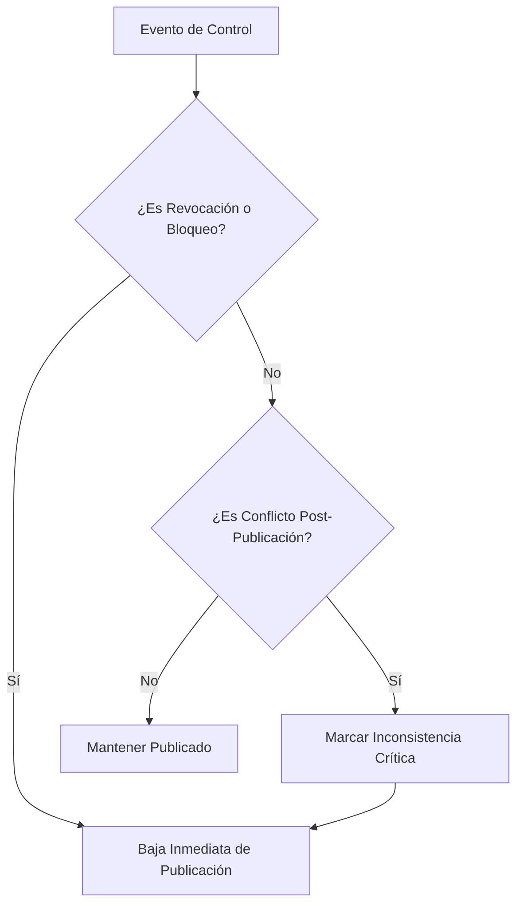

# Capítulo 2: Motores de Negocio, Consentimiento y Niveles de Autorización
**Portal Público — Memoria Viva Pico Truncado**

Este documento detalla el análisis operativo del consentimiento, las reglas de elegibilidad/progreso y los flujos críticos de revocación y retroceso de estados.

---

## 1. Hechos Verificados (Evidencia de Código y Base de Datos)

### 1.1 Significado Operativo de los Niveles de Autorización
Consultados en la tabla `select_options` bajo la categoría `authorization_level`, los niveles están configurados de la siguiente manera:
* **Nivel A**: *Valor: "A"* -> **"Nivel A: Público (Web y Catálogos)"** (Exposición completa autorizada).
* **Nivel B**: *Valor: "B"* -> **"Nivel B: Educativo y Académico"** (Uso restringido a entornos de formación).
* **Nivel C**: *Valor: "C"* -> **"Nivel C: Interno (Solo consulta en Archivo)"** (Consulta física en la sede del archivo).
* **Nivel D**: *Valor: "D"* -> **"Nivel D: Restringido (Solo preservación)"** (Reserva total en almacenamiento).
* *Evidencia*: [scratch/dump_auth_levels.ts](file:///c:/Users/pc/Documents/antigravity/memoriaviva/scratch/dump_auth_levels.ts) (resultados de la base de datos Supabase).

### 1.2 Regla de Elegibilidad de Nivel (E2)
El Motor de Elegibilidad restringe la publicación pública basándose estrictamente en los códigos permitidos.
* *Evidencia*: [src/lib/editorial/editorialConstants.ts:L4-L8](file:///c:/Users/pc/Documents/antigravity/memoriaviva/src/lib/editorial/editorialConstants.ts#L4-L8)
* *Códigos permitidos*: `"A"`, `"public"`, `"public_with_credit"`.
* *Consecuencia*: **Solo el Nivel A es elegible para publicación**. Si un aporte está en Nivel B, C o D, el motor genera un bloqueo legal (`auth_not_public`) y marca `eligibleForPublication = false`.

### 1.3 Preferencias de Crédito del Aportante
Configuradas en `select_options` bajo la categoría `credit_preference`:
* **Nombre completo**: Muestra el nombre real (`contributors.full_name`).
* **Iniciales**: Muestra las iniciales del nombre (ej. "A. F. M.").
* **Familia aportante**: Vincula el crédito a un apellido o grupo familiar (Donación Familia [Barrio/Inst]).
* **Anónimo**: Oculta por completo la autoría.
* *Evidencia*: [scratch/dump_credit_prefs.ts](file:///c:/Users/pc/Documents/antigravity/memoriaviva/scratch/dump_credit_prefs.ts) (resultados de la base de datos Supabase).

### 1.4 Autorización a Nivel de Archivo Individual
* **Hecho**: Actualmente, la tabla `contribution_files` **no cuenta con una columna `authorization_level` ni `consent_verified` propia**.
* *Evidencia*: Esquema físico en [supabase/schema.sql:L66-L76](file:///c:/Users/pc/Documents/antigravity/memoriaviva/supabase/schema.sql#L66-L76).
* *Consecuencia*: **Todos los archivos adjuntos a una contribución heredan el nivel de autorización del aporte principal**. No es posible configurar de manera nativa que una fotografía del aporte sea pública (Nivel A) y el documento de transcripción original sea privado (Nivel C).

---

## 2. Comportamiento Operativo ante Eventos Críticos

Para garantizar el cumplimiento ético y legal, el Portal Público debe comportarse de forma predecible y estricta ante los siguientes eventos:

### 2.1 Revocación del Consentimiento
* **Gatillo**: El aportante revoca su autorización (se desmarca `consent_verified` a `false` en la ficha o se elimina su registro de consentimiento).
* **Comportamiento del Motor**:
  * Regla `E1` bloquea inmediatamente la elegibilidad (`eligibleForPublication = false`).
  * Regla `E6` detecta que el aporte está en estado publicado pero posee un bloqueo activo, lo que eleva el estado a incidencia **Crítica** (`published_with_active_blocks`).
* **Acción Requerida**: El portal debe retirar de forma automatizada e inmediata el aporte de las vistas públicas, invalidando cualquier cacheo (takedown).

### 2.2 Retroceso Editorial (Rollback de Estado)
* **Gatillo**: Un editor cambia el estado editorial de `"Validado"` a `"En revisión"` o `"Datos incompletos"` (ej. por detección de una discrepancia histórica).
* **Comportamiento del Motor**:
  * Regla `E3` bloquea la elegibilidad (ya que `"in_review"` o `"incomplete"` no pertenecen a los códigos habilitantes `PUBLICATION_ELIGIBLE_EDITORIAL_CODES`).
  * El aporte pierde la condición de elegibilidad.
* **Acción Requerida**: Retiro inmediato del catálogo público de consulta.

### 2.3 Conflictos Post-Publicación
* **Gatillo**: Se activa un indicador de control crítico o bloqueante sobre un aporte que ya se encuentra publicado (ej. un reclamo de terceros sobre derechos de autor, indicador `sensitive_data`).
* **Comportamiento del Motor**:
  * Regla `E4` invalida la elegibilidad.
  * Regla `E6` marca conflicto crítico de publicación.
  * El Motor de Progreso (P8) detecta el bloqueo e incrementa la métrica `hasPostPublicationInconsistencies = true`.
* **Acción Requerida**: Cuarentena inmediata. Ocultamiento total en el portal público y envío de notificaciones automáticas al panel administrativo para auditoría urgente.

---

## 3. Recomendaciones y Decisiones Pendientes

### 3.1 Recomendaciones Técnicas
* **Auditoría de Consentimiento por Triggers**: Mantener el trigger inmutable de Supabase que verifica la coherencia entre los registros en la tabla `consent_records` y el flag `consent_verified` en la tabla `contributions` para evitar alteraciones manuales o erróneas en base de datos.
  * *Evidencia de Trigger*: [supabase/migrations/20260718231700_consent_consistency_patch.sql](file:///c:/Users/pc/Documents/antigravity/memoriaviva/supabase/migrations/20260718231700_consent_consistency_patch.sql).

### 3.2 Decisiones Institucionales Pendientes
1. **Tratamiento del Nivel B (Educativo)**: ¿El Nivel B se mantendrá excluido del Portal Público general, o se creará una sección con acceso restringido bajo inicio de sesión (credenciales) para docentes e investigadores de Pico Truncado?
2. **Autorización a nivel de Archivo**: ¿Se incorporará una columna `authorization_level` a la tabla `contribution_files` para posibilitar la publicación parcial de archivos?
3. **Firmas de Convenios**: Para aportes asociados a un convenio institucional (`institutional_agreements`), ¿debe validarse de forma automatizada que el convenio de origen esté activo antes de publicar el aporte?
