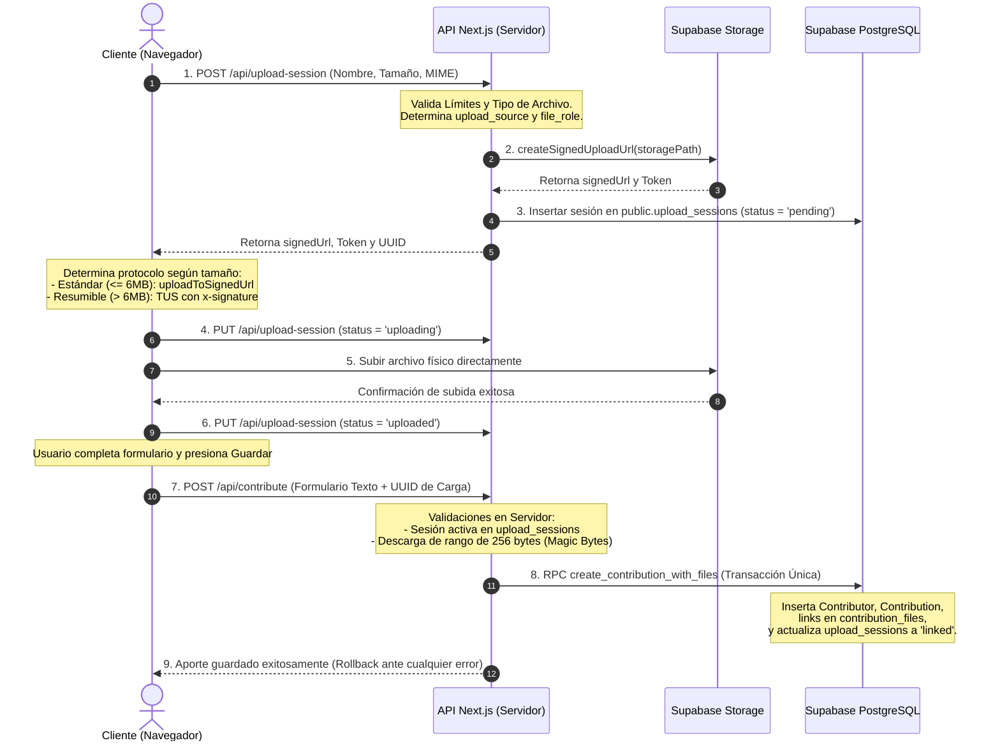

# Arquitectura de Carga Directa y Segura de Archivos Grandes

Este documento detalla la solución de arquitectura implementada en **Memoria Viva Pico Truncado** para permitir la subida directa de archivos de gran tamaño (hasta 50 MB, y configurable a 1 GB cuando se amplíe el plan de Supabase) desde el navegador del usuario hacia **Supabase Storage**.

Esta arquitectura soluciona de raíz el error `413 Payload Too Large` al evitar por completo que el flujo de datos binarios atraviese las **Vercel Functions** (rutas `/api/contribute` o `/api/admin/contribute`).

---

## 1. Arquitectura del Flujo de Carga

---

## 2. Límites de Tamaño y Restricciones del Bucket

### Límite Efectivo
Supabase Storage tiene configurado un límite estricto de **50 MB** (`52,428,800` bytes) a nivel del bucket `historical-uploads`. Por este motivo, la aplicación aplicará en la UI y backend el menor de los límites (es decir, **corta todas las categorías a 50 MB**).

Una vez que el administrador ejecute el comando SQL de actualización del bucket en Supabase, los límites se ampliarán dinámicamente en el backend hasta los siguientes máximos:
- **Imágenes**: 20 MB.
- **Documentos**: 50 MB.
- **Audio**: 250 MB.
- **Video**: 1 GB.

---

## 3. Seguridad y RLS (Row Level Security)

- **Bucket Privado**: El bucket `historical-uploads` no es público. Todo acceso requiere firmas de lectura o tokens de operador autorizados.
- **RLS Restringido**: Se eliminó la política pública de inserción sin restricciones en `storage.objects` e `insert` libre en `contribution_files`.
- **Carga de Invitados**: Los usuarios anónimos **no** tienen permisos de `INSERT` directo utilizando la `anon-key` pública. El acceso de escritura está restringido al uso exclusivo del token firmado temporal entregado por el backend a través de la API `/api/upload-session`.
- **Rutas no Predecibles**: El backend genera carpetas y nombres basados en UUIDs y marcas de tiempo:
  `temporary/{upload_uuid}/{file_uuid}.{extension}`
  Esto impide predecir rutas para ataques de inyección y previene la sobrescritura accidental de archivos originales (`upsert = false`).

---

## 4. Validación Técnica en el Servidor (Magic Bytes)

Para garantizar la consistencia de los archivos sin degradar el ancho de banda del servidor de API:
1. El backend descarga únicamente los **primeros 256 bytes** del archivo subido en Storage mediante una cabecera de rango HTTP:
   `Range: bytes=0-255`
2. El validador inspecciona la cabecera hexadecimal de los bytes (ej. `89504E47` para PNG, `%PDF` para PDF, `RIFF` + `WEBP` para WebP).
3. Si los bytes no corresponden a la categoría (ej. un ejecutable renombrado a `.png`), la API rechaza el aporte, aborta la transacción y actualiza el estado de la sesión de carga a **`quarantined`** en la base de datos para análisis del administrador, impidiendo la vinculación.

---

## 5. Protocolo de Carga Resumible (TUS) y Reanudación

El protocolo **TUS** se activa para archivos mayores a **6 MB** mediante la librería `tus-js-client`.

### Reanudación e Interrupción
1. **Fingerprint Local**: La librería TUS genera una huella única (fingerprint) basada en el tamaño del archivo y el nombre, guardando la URL de carga de TUS en el almacenamiento local del navegador (`localStorage`).
2. **Corte de Red**: Si la conexión se cae, TUS intenta reanudar automáticamente de acuerdo con el intervalo configurado: `[0, 3000, 5000, 10000, 20000]` ms.
3. **Cierre de Navegador o Vencimiento**: Si el usuario cierra el navegador o el token firmado de la sesión expira (validez de 1 hora):
   - El cliente solicita un nuevo token signed-upload a `/api/upload-session`.
   - Se recrea el objeto `tus.Upload` actualizando la cabecera `x-signature` con el nuevo token.
   - El cliente vuelve a llamar a `.start()`. TUS recupera el offset de bytes subidos previamente en el servidor y reanuda el porcentaje restante sin reiniciar desde cero.
4. **Cancelación**: Al presionar "Cancelar", se invoca `tusUpload.abort(true)`, el cual detiene el hilo y remueve activamente el fingerprint local para evitar que reanude en el futuro.

---

## 6. Caso Piloto: Andrés Freile

La subida del caso Andrés Freile (que consiste en un video original de radicación de WhatsApp y una versión con audio restaurado) se procesa de la siguiente manera:
1. En el panel administrativo (`aportes/nuevo`), el operador selecciona ambos archivos.
2. Junto a cada archivo en la lista, se despliega un selector donde se asigna:
   - Video original de WhatsApp -> rol: `original`.
   - Video con audio restaurado -> rol: `restored`.
3. Al presionar guardar, ambos archivos se cargan directamente y se asocian de forma atómica en la tabla `contribution_files` compartiendo el mismo `contribution_id`.

---

## 7. Mecanismo de Limpieza de Archivos Temporales Huérfanos

Las cargas que se inician pero nunca llegan a guardarse o vincularse a un aporte quedan en Storage como huérfanas bajo la carpeta `temporary/`.

El script de mantenimiento `scripts/cleanup-uploads.ts` automatiza esta limpieza bajo las siguientes reglas:
- **Estado de Simulación**: Por defecto se ejecuta en **dry-run** (solo simulación). Requiere la bandera `--execute` para realizar bajas.
- **Antigüedad Mínima**: 48 horas.
- **Baja Lógica**: Las filas de sesiones en `upload_sessions` se marcan como `'deleted'` con su respectiva fecha `deleted_at` para fines de auditoría. **Nunca** se eliminan las filas para conservar la trazabilidad histórica de quién intentó cargar qué.
- **Baja Física**: Se eliminan permanentemente los binarios huérfanos de la carpeta `temporary/{upload_uuid}/` en Supabase Storage.
- **Políticas de Exclusión**:
  - `linked`: Nunca se eliminan.
  - `quarantined`: Se omiten de la limpieza automática y requieren revisión administrativa.
  - `uploading`: Se eliminan únicamente si no registran actividad en las últimas 48 horas.
