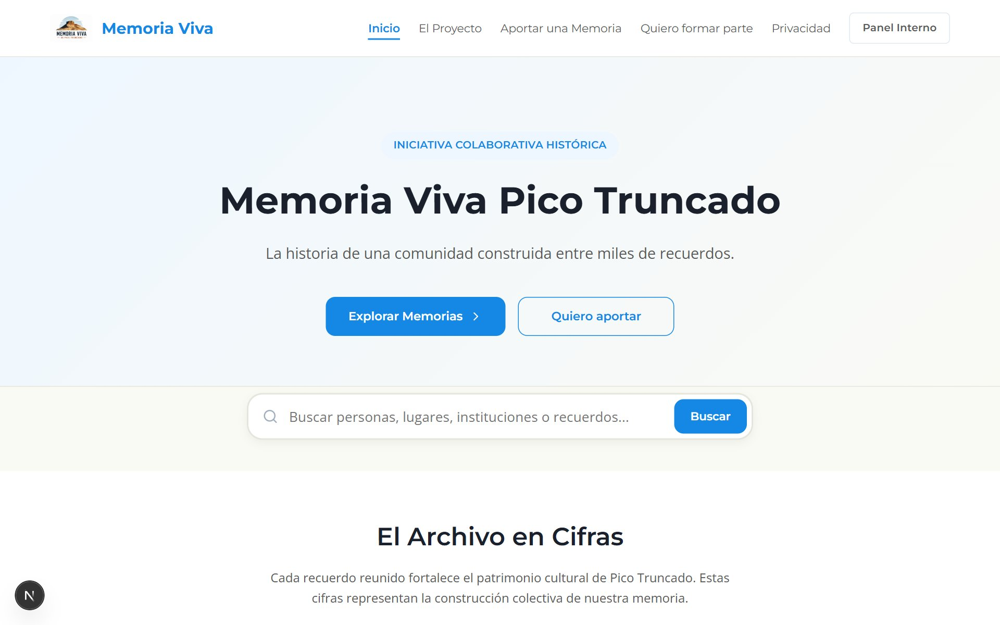
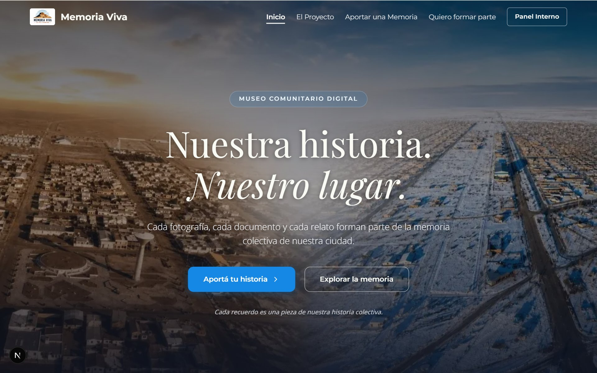
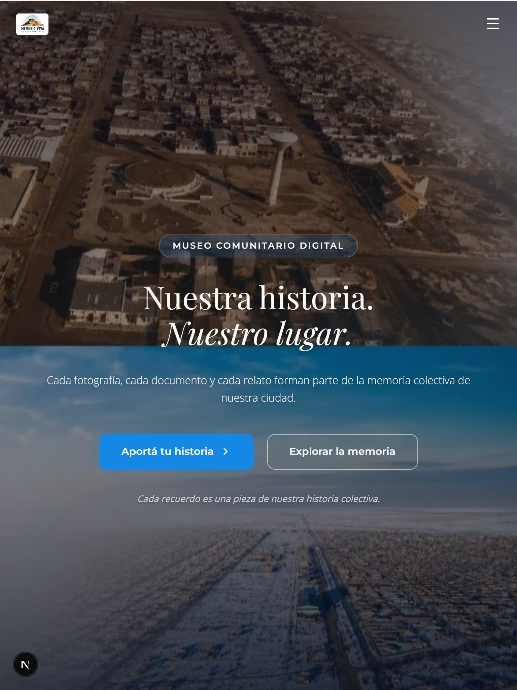
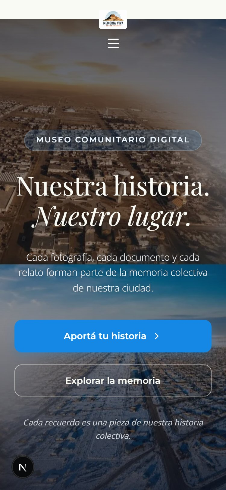

# Recorrido de Avances: Portada Nivel Museo Digital (Etapas 1 y 2)

La implementación está lista para validación técnica. Las pruebas automatizadas (test suite y linting) se ejecutarán una vez aprobada la propuesta visual de esta etapa.

A continuación, se presenta la validación visual comparativa del diseño implementado sobre la rama de desarrollo `feature/museum-home-stage-1-2`.

---

## Comparación Visual: Antes y Después

### ANTES (Hero institucional simple)
El diseño original consistía en una sección de color plano con un degradado de azul claro a blanco cálido, sin material fotográfico ni carácter inmersivo.

---

### DESPUÉS (Hero inmersivo tipo museo digital)

#### 1. Vista de Escritorio (Desktop)
En pantallas grandes, se aprovecha la panorámica original en toda su anchura. La cabecera superior comienza transparente y se torna blanca y sólida con desenfoque de fondo al descender por la página.

#### 2. Vista de Tablet (Tablet)
En pantallas medianas, la composición se ajusta conservando la panorámica integrada y adaptando los márgenes y tipografía para una legibilidad óptima.

#### 3. Vista de Teléfonos Celulares (Mobile)
En pantallas verticales, se despliega la variante optimizada para móvil. Este recurso toma la mitad izquierda (Pico Truncado histórico / sepia) y la apila de forma vertical sobre la mitad derecha (Pico Truncado nevado / frío), preservando ambos periodos de manera clara y visible para el usuario sin que se recorten los laterales.

---

## Métricas de Rendimiento (Lighthouse)

Los resultados definitivos de Lighthouse se obtuvieron compilando y ejecutando el proyecto en modo producción (`npm run build && npm run start`):

### Lighthouse Desktop
- **Performance**: 90/100
- **Accessibility**: 96/100
- **Best Practices**: 100/100
- **SEO**: 100/100

### Lighthouse Mobile
- **Performance**: 67/100
- **Accessibility**: 93/100
- **Best Practices**: 100/100
- **SEO**: 100/100

---

## Qué "No se modificó" (Garantías de Estabilidad)

Para preservar la estabilidad de la plataforma y sus flujos existentes, confirmamos que **no se modificaron**:
- **Base de datos Supabase**: Ningún esquema, tabla, función o disparador ha sido alterado.
- **Políticas RLS**: Se mantienen estrictamente todas las políticas de Row Level Security.
- **Buckets**: El almacenamiento de archivos históricos del bucket `historical-uploads` no ha sufrido alteraciones.
- **Autenticación**: Los flujos de registro e inicio de sesión del panel administrativo siguen intactos.
- **Variables de entorno**: No se agregaron ni alteraron claves o credenciales.
- **Servicios**: No se ha modificado la capa lógica de `HomeService`, agregadores o repositorios.
- **API públicas**: El listado de endpoints y los schemas de validación de Zod se mantienen idénticos.
- **Datos reales**: No se alteraron los registros cargados de aportes o colaboradores.
- **Roles**: No se modificaron perfiles ni permisos de usuarios.
- **Formularios existentes**: El formulario de aportación de recuerdos continúa operando sin modificaciones.

---

## Próximos Pasos (Tras aprobación visual)
Una vez recibido tu visto bueno para la propuesta estética, procederemos a:
1. Ejecutar las comprobaciones automáticas del checklist (`npm run test:public` y `npm run lint`).
2. Validar la accesibilidad y navegación por teclado en los viewports.
3. Generar el reporte final con los resultados técnicos para cerrar las Etapas 1 y 2.
